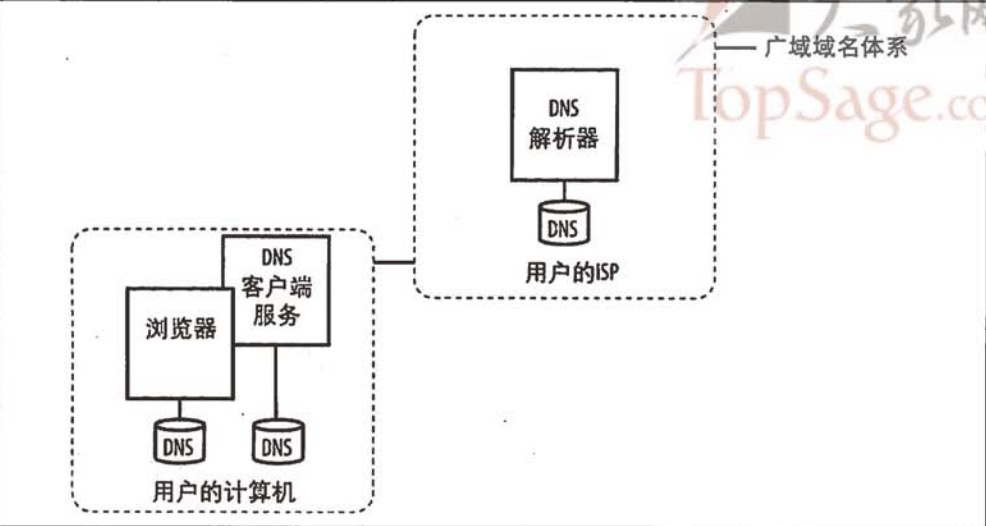

<!-- TOC -->

- [概览](#概览)
    - [1 减少Http请求](#1-减少http请求)
        - [1.1 使用图片地图](#11-使用图片地图)
        - [1.2 CSS Sprites](#12-css-sprites)
        - [1.3 内联图片](#13-内联图片)
        - [1.4 合并脚本和样式表](#14-合并脚本和样式表)
    - [2 使用CDN](#2-使用cdn)
    - [3 添加Expires头](#3-添加expires头)
        - [3.1 Expires头](#31-expires头)
        - [3.2 Max-Age和mod_expires](#32-max-age和mod_expires)
        - [3.3 空缓存VS完整缓存](#33-空缓存vs完整缓存)
        - [3.4 修订文件名](#34-修订文件名)
    - [4 压缩组件](#4-压缩组件)
        - [4.1 压缩是如何工作的](#41-压缩是如何工作的)
        - [4.2 压缩什么](#42-压缩什么)
        - [4.3 节省的数据量](#43-节省的数据量)
        - [4.4 配置](#44-配置)
        - [4.5 代理缓存](#45-代理缓存)
        - [4.6 边缘情形](#46-边缘情形)
    - [5 将样式表放在顶部](#5-将样式表放在顶部)
        - [5.1 逐步呈现](#51-逐步呈现)
        - [5.2 白屏](#52-白屏)
    - [6 将脚本放在底部](#6-将脚本放在底部)
        - [6.1 脚本带来的问题](#61-脚本带来的问题)
        - [6.2 并行下载](#62-并行下载)
        - [6.3 脚本阻塞下载](#63-脚本阻塞下载)
        - [6.4 最差情况:将脚本放在顶部](#64-最差情况将脚本放在顶部)
        - [6.5 最佳情况:将脚本放在底部](#65-最佳情况将脚本放在底部)
    - [7 避免CSS表达式](#7-避免css表达式)
        - [7.1 更新表达式](#71-更新表达式)
        - [7.3 解决方案](#73-解决方案)
    - [8 使用外部JS和CSS](#8-使用外部js和css)
        - [8.1 内联 VS 外置](#81-内联-vs-外置)
        - [8.2 页面查看](#82-页面查看)
        - [8.3 组件重用](#83-组件重用)
        - [8.4 主页](#84-主页)
        - [8.5 两全其美](#85-两全其美)
    - [9 减少DNS查找](#9-减少dns查找)
        - [9.1 DNS和TTL](#91-dns和ttl)
        - [9.2 影响DNS缓存的因素](#92-影响dns缓存的因素)
        - [9.3 TTL 值](#93-ttl-值)
        - [9.4 浏览器的视角](#94-浏览器的视角)
        - [9.5 减少DNS查找](#95-减少dns查找)
    - [10 精简JS](#10-精简js)
    - [11 避免重定向](#11-避免重定向)
    - [12 移除重复脚本](#12-移除重复脚本)
    - [13 配置ETag](#13-配置etag)
    - [14 使Ajax可缓存](#14-使ajax可缓存)
    - [15 解析十大网站](#15-解析十大网站)

<!-- /TOC -->

# 概览

前端解析HTML时间其实只占到整个页面渲染的10%到20%，那么其余的时间都干什么去了~？我们能怎么去优化呢?
上述问题就是黄金法则问题

## 1 减少Http请求

### 1.1 使用图片地图

通过图片合并操作减少Http请求

### 1.2 CSS Sprites

1. 优点
* 大大的减少Http请求，提高性能
* 减少网络传输的总量

2. 缺点
* 前端处理时需要考虑布局的问题
* CSS合并不叫繁琐
* 后期维护比较麻烦，添加或者删除图表都要做CSS的修改

3. 缺点

### 1.3 内联图片

1. 优点
* 减少Http请求
* 提高性能

2. 缺点
* 浏览器不会缓存图片
* 只支持IE8以上的浏览器
* 超过100K，加载速度会变慢

### 1.4 合并脚本和样式表

<pre>
    建议JS脚本和CSS脚本分别不同的合并
</pre>

## 2 使用CDN

通过拉近用户请求和服务器之间的距离减少网络传输时间。

## 3 添加Expires头

通过缓存数据减少Http请求

### 3.1 Expires头

浏览器使用缓存减少HTTP请求的数量，并减少Http响应的大小，使Web页面加载得更快。
Expires告诉浏览器，在这一日期/时间之前，响应可以使用缓存数据

缺点:过期时间需要客户端和服务端的时钟要一致，不然就会导致超时使用的问题

### 3.2 Max-Age和mod_expires

克服了expires头的限制，他指定能缓存多久，以秒为单位定义更新窗口

mod_expires apache模块使你的使用Expires头时能够像max-age一样以相对的方式设置日期。这是通过expires_default指令来完成的。

```bash
    <FilesMatch ".(gif|jpg|css)$">
        ExpiresDefault "access plus 10 years"
    </FilesMatch>
```

### 3.3 空缓存VS完整缓存

完整缓存可以很大情况下可以改善用户体验，建议能够使用的话尽量使用缓存技术

### 3.4 修订文件名

缓存的问题在于如果有新的数据发布时，不能及时的获取到新的组件。那么在这个情况下，可以通过修改所有的链接来实现全新的数据都从最新的服务器下载

## 4 压缩组件

减少Http响应的大小来减少响应时间。

### 4.1 压缩是如何工作的

减少文件体积的文件压缩已经在Email和Ftp站点中使用了很多年了，这项技术也可以用于想浏览器发布压缩的web页面。在Http 1.1 开始，Web客户端可以通过Http请求中的Accept-Encoding头来标识对压缩的支持。gzip是最流行的压缩方法
<pre>
Accept-Encoding: gzip,defate
</pre>
Web服务器需要通过在响应中Content-Encoding: gzip来通知客户端使用解压的模式解析返回参数

### 4.2 压缩什么

<pre>
压缩一般针对CSS文件和JS文件，对于图片和Flash就不必压缩数据。  
压缩也是有成本的，选择压缩的返回格式，需要CPU时间片压缩，客户端需要CPU时间解压。所以选择压缩的方案的时候需要评估收益是否大于开销
经验值为1K，可以通过参数mod_gzip_minimum_file_size控制希望压缩的文件的最小值。默认是500B
</pre>

### 4.3 节省的数据量

一般压缩之后网络传输的数据会节省50%以上

### 4.4 配置

略

### 4.5 代理缓存

<pre>
代理的原理如下:
浏览器通过代理服务器请求web服务器，然后缓存数据，那么可能出现一下情况:
A: 一个不支持gzip的浏览器首先访问代理服务器，代理服务器获取到没有压缩的数据，然后缓存起来
B: 一个支持gzip的浏览器然后访问代理服务器，代理服务器将缓存的数据返回给浏览器。
试想:如果上述B先发生，A就会出现问题了

解决方案:
在Web服务器响应中添加Vary头。Web服务器告诉代理根据一个或者多个请求头来改变缓存的响应。那么产生的效果是代理服务器会缓存两条记录，一条是没有压缩的，一条是压缩过的数据

Vary: Accept-Encoding
</pre>

### 4.6 边缘情形

<pre>
这个是针对IE5.5版本的，这些浏览器不支持gzip的解压情况。但是当前可以不考虑
</pre>

## 5 将样式表放在顶部

### 5.1 逐步呈现

简单说就是组件逐步的渲染出来，给用户以视觉化的回馈。将样式表放在底部会阻塞逐步呈现的实现，会导致比较长时间的白屏

### 5.2 白屏

* 将样式表放在页面底部会导致白屏
* 将样式表放在顶部可以抑制白屏现象的产生
* 引用样式表时建议使用Link标签而非import标签，将其放在Header中，因为import标签可能导致白屏

## 6 将脚本放在底部

### 6.1 脚本带来的问题

加载脚本的语句放在header的话会阻止并行下载，导致加载速度变慢

### 6.2 并行下载

Http 1.1规定从一个主机并行下载的组件是有个数限制的，这个随着浏览器不同而不同。如果将图片以及其他信息放在不同的主机上可以增大下载并行度。

### 6.3 脚本阻塞下载

下载脚本的时候会阻塞并行下载，原因有两个:  
1. js可能调用document.write()方法修改HTML的结构
2. JS和组件可能有相互依赖的关系，所以必须按照顺序处理

### 6.4 最差情况:将脚本放在顶部

如果将脚本放在顶部的话，那么所有的HTML组件都需要等待JS下载完成之后才能渲染出来，这样会出现长时间的白屏现象

### 6.5 最佳情况:将脚本放在底部

放置脚本的最好的最好的地方是页面的底部。这不会阻塞页面内容的呈现，同时页面中的可视组件能够尽早的下载

## 7 避免CSS表达式

CSS表达式是一种对性能影响比较严重的方式。例如以下的CSS样式

```bash
background-color: expression ((new Date()).getHours()%2?"#B8D4EF":"#F08A00");
```

上述CSS中嵌入了JS代码进行每小时更新背景颜色

### 7.1 更新表达式

CSS表达式对于更新的频率比我们想象中要快得多，比如窗口的滑动、鼠标的移动都会导致CSS表达式的重新计算

### 7.3 解决方案

1. 一次性表达式
2. 事件处理器

## 8 使用外部JS和CSS

### 8.1 内联 VS 外置

1. 纯粹而言，内联要快于外置连接的
2. 内联的一般不会被缓存起来，但是外置的连接可以被缓存起来

### 8.2 页面查看

1. 对于低频的请求，那么内置要更快于外置
2. 对于高频的请求，那么外置要优于内置

### 8.3 组件重用

1. 外部连接对于代码的重用是有优势的
2. 内部连接对于低吗的重用是有弊端的

### 8.4 主页

推介使用内联的方式

### 8.5 两全其美

1. 加载后下载(onLoad方法处理)
2. 动态内联(使用cookie来决定使用内联还是外联的方式处理)

## 9 减少DNS查找

<pre>
Internet是通过IP进行数据查找的，但是在实际生活中使用的是域名，于是就需要DNS(Domain Name System)来进行解析了。可以
将多个主机关联到一个主机名。  
然而DNS也需要解析时间，DNS解析一般需要20到120ms。在DNS查找完成之前，浏览器不能从主机那里下载到任何东西。响应时间依赖于DNS解析速度
</pre>

### 9.1 DNS和TTL

DNS查找可以被缓存用来提高性能。这种缓存可以发生在由ISP或局域网中的一台特殊的缓存服务器上，我们这里会探索在发生在独立用户计算机中的缓存。

浏览器首先会将DNS缓存到本地，如果本地存在那么就不请求DNS服务器了，如果没有则请求DNS服务器。但是DNS可能是会变更的，所以DNS本地缓存可能会被清除

### 9.2 影响DNS缓存的因素

<pre>
首先，DNS服务器返回的数据包括一个TTL(Time-to-Live)，即存活时间
但是浏览器通常会忽略该值，而使用自定义的过期时间。同时，HTTP中的keep-alive属性可以覆盖TTL和浏览器的时间限制。简单说，就是浏览器和web服务端保持着通信，那么DNS就不会被清除掉
浏览器对于缓存的DNS数量也有限制，如果短时间访问多个不同的主机，那么早前缓存的数据可能会被清除掉
但是即使浏览器丢掉了缓存，操作系统中可能依然缓存着，这在一定程度上可以弥补浏览器清除缓存带来的不利影响
</pre>

### 9.3 TTL 值

1. 避免使用过短的TTL值
2. 平均值在150秒

### 9.4 浏览器的视角

IE中的DNS缓存由DNS client管理，可以使用ipconfig /displaydns和 ipconfig /flushdns来查看和刷新服务缓存。同时重启也会导致清空缓存。除了DNS client之外，IE和Firefox都保存着自己的DNS缓存。重启浏览器会导致DNS缓存清空但是不能清空DNS client 的缓存

1. IE: 注册表中处理
2. FireFox: 浏览器的配置项

### 9.5 减少DNS查找

减少DNS查找可以提高并发度，从而提高性能

## 10 精简JS

## 11 避免重定向

## 12 移除重复脚本

## 13 配置ETag

## 14 使Ajax可缓存

## 15 解析十大网站